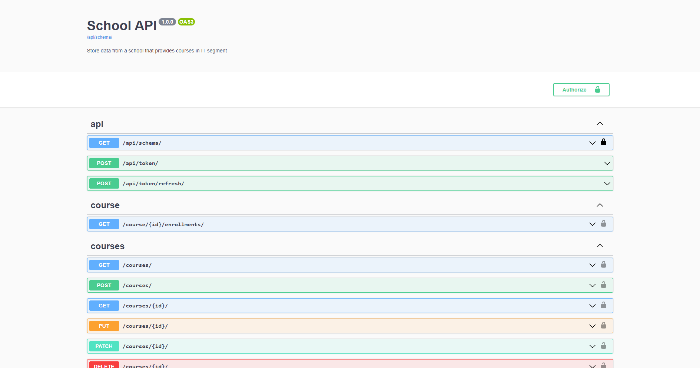
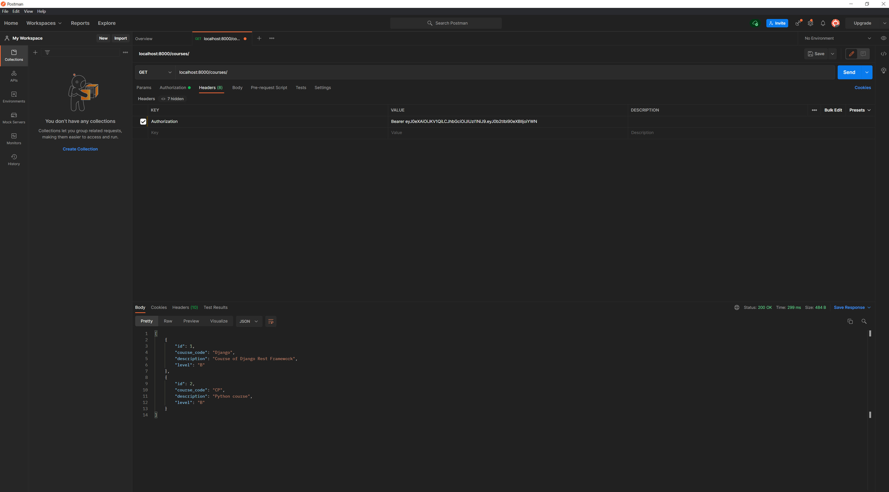
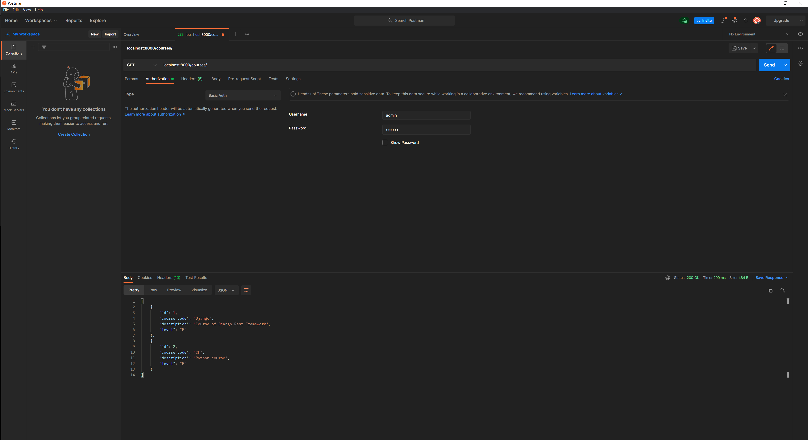

# Django_API_School
This API stores data for a fictional school

1) Clone this repository.
2) Access the directory of the project.
3) python manage.py createsuperuser (define the user and password).
4) Run the commands from commands.txt
5) Access http://localhost:8000/admin

 
 
The request can be sent using Postman or Curl command. All endpoints are indicated in the documentation

/api/swagger

/api/redoc

A first request requiring the Bearer token should be sent by post request. Two authentications are needed, basic and token authentications.

email: edson.costa@hotmail.com
